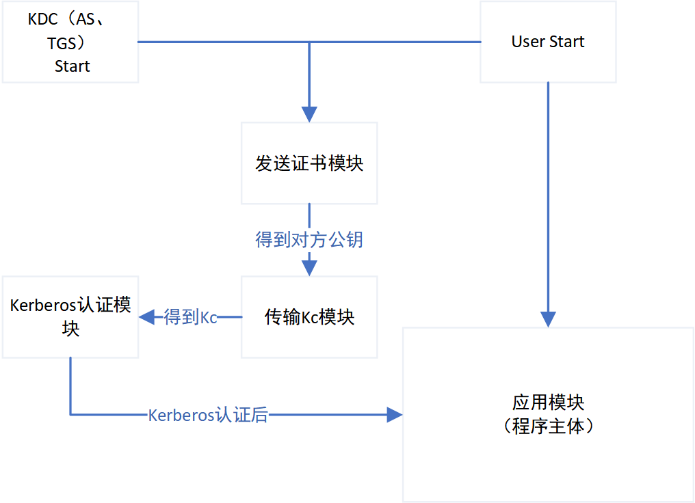

# 项目介绍
1.	本程序为基于 ***Kerberos*** 认证（***DES***加密）和 ***RSA***加密的 ***IM*** 分布式通讯工具。

2.	工作分为 ***7*** 个工作模块，分别为
 
	① RSA 加密，包括公私钥的生成，以及信息加密

	② DES 加密，通过约定秘钥加密信息

	③ Kerberos 认证 ，ClientA与AS通讯，获取TGT；clientA凭TGT向TGS通讯，获取session key 以及 用ClintB与AS Master Key加密的报文；clientA与ClientB通信同步session key

	④ 数字签名，通过RSA加密实现
 
	⑤ 网络通讯，网络发送数据报文

	⑥ 应用，IM通讯，https://www.jianshu.com/p/b777938a4c52

	⑦ 互发证书
 

3.	程序包括以下功能：

	①加好友，用户A与用户B 互相添加好友

	②群聊信息，多个用户进入一个聊天体系
	
	③搜索功能，根据 昵称，账号精确查找

	④聊天内容，两个用户的聊天体系

	⑤登录界面

	⑥注册，修改密码+拓展（忘记密码），通过网页实现
	
	⑦拓展功能+++

# 程序功能流程图
<centre>

<b>程序功能流程图</b>

# 数据库
	rm-uf6t4cbyfz681x569.mysql.rds.aliyuncs.com  
    端口：3306
